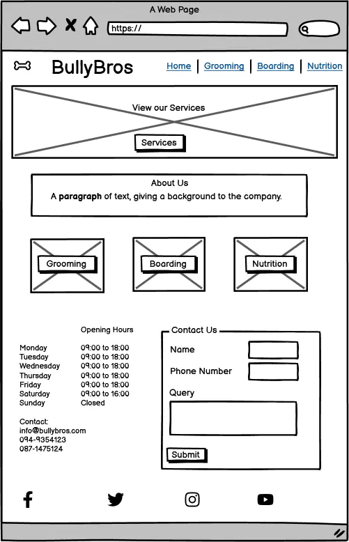

# Table of Contents

1. [Introduction](#bullybros)
2. [User Stories](#user-stories)
    1. [First Time User Goals](#first-time-user-goals)
    2. [Returning User Goals](#returning-user-goals)
    3. [Frequent User Goals](#frequent-user-goals)
3. [Features](#features)
    1. [The Colour Scheme](#the-colour-scheme)
    2. [The Fonts Used](#the-fonts-used)
4. [Wireframes](#wireframes)
    1. [Desktop and Mobile Homepage](#desktop-and-mobile-homepage)
    2. [Desktop and Mobile Subpages](#desktop-and-mobile-subpages)
5. [Website Pages](#website-pages)
    1. [The Homepage](#the-homepage)
      1. [Existing Feature](#existing-features)
    2. [Grooming Page](#grooming-page)
    3. [Boarding Page](#boarding-page)
    4. [Nutrition Page](#nutrition-page)
6. [Testing](#testing)
    1. [Validator Testing](#validator-testing)
7. [Commit History](#commit-history)
8. [Deployment](#deployment)
9. [Credits](#credits)
10. [Content](#content)

 
 

# Bullybros

Bullybros is a site that is spefically aimed at providing grooming, boarding and nutritional services and advice for dog owners.  As bulldogs are a unique and a quite expensive their owners tend to be more willing to pay more to ensure they are happy and healthy, thats why that particular breed has been the main focus of this site.

# User Stories

## **First Time User Goals:**
- As a user, I want to easily navigate the BullyBros website to understand the services they offer for my pet.
- As a user, I want to learn about grooming, boarding, and nutrition services available for my pet on my first visit.
- As a user, I want to access contact information easily so I can inquire about services if needed during my initial exploration.
- As a user, I want to understand the business's operating hours for future reference when planning to visit.
- As a user, I want to connect with BullyBros on social media platforms during my first visit for updates and engagement.

## **Returning User Goals:**
- As a user, I want to quickly find specific information about grooming, boarding, or nutrition services on my return visits.
- As a user, I want to check for any updates or changes to the services provided by BullyBros during subsequent visits.
- As a user, I want to easily access contact information for further inquiries or appointments when I revisit the website.
- As a user, I want to verify the current operating hours before planning a visit during my return visits.
- As a user, I want to engage with BullyBros on social media for ongoing interaction and updates when I return to the website.

## **Frequent User Goals:**
- As a user, I want to directly access desired services without navigating through the entire website on my frequent visits.
- As a user, I want to stay informed about any new services or promotions offered by BullyBros during my regular visits.
- As a user, I want to use the contact form efficiently for regular inquiries or scheduling appointments when I visit frequently.
- As a user, I want to memorize or bookmark the business's operating hours for convenience during my frequent visits.
- As a user, I want to actively participate in discussions or promotions through BullyBros' social media channels during my frequent visits.

 

# Features 

## The Colour Scheme
The color scheme used was based on the typical bulldog colouring.  The colours used are also calming and relaxing and that is the feeling the Users should have when they visit the website.  THis pallet was generated using [Color Fetch](https://www.colorfetch.com/)

## The Fonts Used

The fonts used were a mix of soft and strong.  This is a reflection on the nature of the bulldog, they look big bold and strong but behind all that image is a very soft caring animal. The aim of this website was also to enhance the Users experience by presenting the information in a clear, legible format. The fonts used satisfied this requirement as they did not over power any other features of the website and protrayed the neccassary information in a clear easy to read mannor.

- [Montserrat](https://fonts.google.com/specimen/Montserrat) 
- [Sans-serfi](https://www.myfonts.com/pages/sans-serif-fonts)
- [Oswald](https://fonts.google.com/specimen/Oswald)
- [Lucida sans](https://www.cufonfonts.com/font/lucida-sans#google_vignette)

## Wireframes
### Desktop and Mobile Homepage
   

### Desktop and Mobile Subpages
  

The subpage layout remained the same for all of the subpages.

# Website Pages
## The Homepage
The website consists of four webpages.  The Homepage is the Users first point of contact with the business when the first visit the site, on this page there is a Navigation bar that consists of the Logo and the Home, Grooming, Boarding and Nutrition pages links.  The Grooming, Boarding and Nutrition pages are also accesible via the link buttons under each image in the Services Section on the homepage.

### Existing Features

- __Navigation Bar__

  - Featured on all four pages, the full responsive navigation bar includes the Logo, Home page, Grooming, Boarding and Nutritional pages and is identical in each page to promote intuative easy to use navigation for the User.
  - This section will allow the user to easily navigate from page to page across all devices without having to revert back to the previous page via the ‘back’ button. 

Nav Bar for Tablet, Laptop and Desktop

 

Nav Bar for Mobile

- __The Hero image__

  - The Home Page includes a Hero image with text overlay to allow the user to quickly navigate to the Services section of the Homepage. 

- __About Section__

  - The User is introduced to the Company with a brief history about the Company via the About us section, however this site is built to serve the Users needs so this section was kept very small as to not distract the User away from what they are really there for which is to avail of a Service. 

- __Services section__

  - This section allows the User to Navigate directly to the page that they want more information about, the buttons under each of the images specific to each of the Services provide the Users with this easy to use navigation option. 

- __The Footer__ 
  - The footer section is invaluable to the User as it provides Opening and Closing times for the Company, it also provides the User with an easy to use form in order to contact the Company regarding any queries or bookings they would like to make.
  - The foote0r section includes links to the relevant social media sites for Bullybors. The links will open to a new tab to allow easy navigation for the user. 
  - The Social Media links in the footer allow the Users to become more familiar with the company and follow the Companys updates via social media.
  - The footer information is consistant across all pages and the form can easily be submitted on any of the 4 pages.

## Grooming Page
- The Grooming page is very clear and non-clutered, the rational for this is to protray a simple relaxing feel with only the necessary information presented to the User. 
- The Navigation Section is not altered from the Navigation Section used in the Home page.
- The Footer is also consistent with the homepage.
- The Grooming Section consists of a list of Services we provide as well as an image of a dog being washed to reflect the grooming process.

 
 

Laptop and Desktop Grooming Page
 

 
 

Tablet Grooming Page
 

 
 

Mobile Grooming Page
 

 
 

## Boarding Page
- The Boarding page is consistent with the methodology used in the Grooming Page which is that of a very clear and non-clutered feel.
- The Navigation Section is not altered from the Navigation Section used in the Home page.
- The Footer is also consistent with the homepage.
- The Boarding Section consists of a list of Services we provide as well as an image of a dog in bed to reflect the Boarding facilites on offer.

 
Laptop and Desktop Boarding page
 

 

Tablet Boarding page
 

 

Mobile Boarding page
 

 

## Nutrition Page
- The Nutrition page is consistent with the methodology used in the Grooming and Boarding Page's which is that of a only the necessary information being displayed to the User, the rationale for this is the fact that when it comes to Nutrition for animals there is alot of confusion regarding what to focus on to make sure your dog remains healty and what the owner should be checking regulary.
- The Navigation Section is not altered from the Navigation Section used in the Home page.
- The Footer is also consistent with the homepage.
- The Nutrition Section consists of a list of Services we provide as well as an image of a dog in eating to reflect the how important it is to make sure your dog is healthy.

 
Laptop and Desktop Nutrition page
 

 

Tablet Nutrition page
 

 

Mobile Nutrition page
 

 

# Testing 

## Validator Testing 

- HTML
  - No errors were returned when passing through the official W3C Validator 
   
  W3C Validator Report
   
  
   
   
- CSS
  - No errors were found when passing through the official Jigsaw W3C CSS Validator.
   
  Jigsaw Test Report
   
  
      
      
- Lighthouse Performance, Accessibility, Best Practices and SEO

  - Accessiblity, Best Practices, SEO and Performance ranked very high on the lighthouse testing. 
   
  Lighthouse Report
 

  
   
  
# Commit History

During the development of this site, I made several commits, however following research into how and when commits technically should be completed and from reading this article [How often should you commit](https://medium.com/@asifnahian/git-how-often-should-you-commit-c133e5473d76) I developed a clearer understanding of the commit process. 
That being said the rationale behind my numerous commits for this website developement was:

- Learning process: As I was learning how to use Git and GitHub, I made frequent commits to grasp version control better.

- Safety net: Frequent commits act as a safety net. If something goes wrong, I can easily revert to a previous state without losing much progress.

- Granularity of changes: Each commit reflects specific improvements or changes made to the project, helping to track its progress over time.

 
# Deployment

This section should describe the process you went through to deploy the project to a hosting platform (e.g. GitHub) 

- The site was deployed to GitHub pages. The steps to deploy are as follows: 
  - In the GitHub repository, navigate to the Settings tab 
  - From the source section drop-down menu, select the Main Branch
  - Once the main branch has been selected, the page will be automatically refreshed with a detailed ribbon display to indicate the successful deployment. 

The live link can be found here - https://nikkig087.github.io/bullybros/

# Credits 

## Content 

- Instructions on how to implement form validation on the Sign Up page was taken from the love running project [Love Running](https://github.com/Code-Institute-Solutions/love-running-v3/tree/main/7.1-creating-the-form).
- The icons in the website were taken from [Font Awesome](https://fontawesome.com/)
- During the development of the website [W3 Schools](https://www.w3schools.com/) was utilized to enhance understanding and proficiency in HTML and CSS coding.

## Media

The photos used on the home and sign up page are from Unspash as per the links listed below, however they were edited to adjust to meet the requirements of the website layout:

* [Dog in Bath](https://unsplash.com/photos/brown-and-white-short-coated-dog-xypTOFe_hqc?utm_content=creditShareLink&utm_medium=referral&utm_source=unsplash)
 

* [Dog in Bed](https://unsplash.com/photos/fawn-pug-lying-on-red-and-white-floral-textile-9AGJA0Qlops?utm_content=creditShareLink&utm_medium=referral&utm_source=unsplash)
 

* [Dog with bowl](https://unsplash.com/photos/white-and-black-short-coated-dog-on-green-grass-field-G9BXq5Yg5qAutm_content=creditShareLink&utm_medium=referral&utm_source=unsplash)
 

* [Hero Dog](https://unsplash.com/photos/brown-puppy-lying-on-textile-7q884uxYVtk?utm_content=creditShareLink&utm_medium=referral&utm_source=unsplash)
 

* [Dog on Grass](https://unsplash.com/photos/white-and-black-short-coated-dog-lying-on-green-grass-during-daytime-gikJaHkQ3yA?utm_content=creditShareLink&utm_medium=referral&utm_source=unsplash)
 

* [White Dog lying on Texttile](https://unsplash.com/photos/short-coat-white-dog-lying-on-white-textile-m6tiC77O-Ho?utm_content=creditShareLink&utm_medium=referral&utm_source=unsplash)
 

* [Brown and White Dog in a Bathtub](https://unsplash.com/photos/a-brown-and-white-dog-sitting-in-a-bathtub-1W7bJqkvdSc?utm_content=creditShareLink&utm_medium=referral&utm_source=unsplash)
 

* [English Bulldog on Wooden Table](https://unsplash.com/photos/white-and-brown-english-bulldog-on-brown-wooden-table-RCDcigzmtII?utm_content=creditShareLink&utm_medium=referral&utm_source=unsplash)

