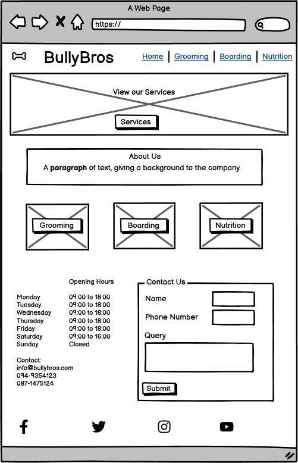

# Bullybros

Bullybros is a site that is spefically aimed at providing grooming, boarding and nutritional services and advice for dog owners.  As bulldogs are a unique and a quite expensive their owners tend to be more willing to pay more to ensure they are happy and healthy, thats why that particular breed has been the main focus of this site.

# User Stories

**First Time User Goals:**
- As a user, I want to easily navigate the BullyBros website to understand the services they offer for my pet.
- As a user, I want to learn about grooming, boarding, and nutrition services available for my pet on my first visit.
- As a user, I want to access contact information easily so I can inquire about services if needed during my initial exploration.
- As a user, I want to understand the business's operating hours for future reference when planning to visit.
- As a user, I want to connect with BullyBros on social media platforms during my first visit for updates and engagement.

**Returning User Goals:**
- As a user, I want to quickly find specific information about grooming, boarding, or nutrition services on my return visits.
- As a user, I want to check for any updates or changes to the services provided by BullyBros during subsequent visits.
- As a user, I want to easily access contact information for further inquiries or appointments when I revisit the website.
- As a user, I want to verify the current operating hours before planning a visit during my return visits.
- As a user, I want to engage with BullyBros on social media for ongoing interaction and updates when I return to the website.

**Frequent User Goals:**
- As a user, I want to directly access desired services without navigating through the entire website on my frequent visits.
- As a user, I want to stay informed about any new services or promotions offered by BullyBros during my regular visits.
- As a user, I want to use the contact form efficiently for regular inquiries or scheduling appointments when I visit frequently.
- As a user, I want to memorize or bookmark the business's operating hours for convenience during my frequent visits.
- As a user, I want to actively participate in discussions or promotions through BullyBros' social media channels during my frequent visits.

 

# Features 

## The Colour Scheme
The color scheme used was based on the typical bulldog colouring.  The colours used are also calming and relaxing and that is the feeling the Users should have when they visit the website.  THis pallet was generated using [Color Fetch](https://www.colorfetch.com/)

## Wireframes
### Desktop and Mobile Homepage
   

### Desktop and Mobile Subpages
  

The subpage layout remained the same for all of the subpages.

## The Homepage
The website consists of four webpages.  The Homepage is the Users first point of contact with the business when the first visit the site, on this page there is a Navigation bar that consists of the Logo and the Home, Grooming, Boarding and Nutrition pages links.  The Grooming, Boarding and Nutrition pages are also accesible via the link buttons under each image in the Services Section on the homepage.

### Existing Features

- __Navigation Bar__

  - Featured on all four pages, the full responsive navigation bar includes the Logo, Home page, Grooming, Boarding and Nutritional pages and is identical in each page to promote intuative easy to use navigation for the User.
  - This section will allow the user to easily navigate from page to page across all devices without having to revert back to the previous page via the ‘back’ button. 

- __The Hero image__

  - The Home Page includes a Hero image with text overlay to allow the user to quickly navigate to the Services section of the Homepage. 

- __About Section__

  - The User is introduced to the Company with a brief history about the Company via the About us section, however this site is built to serve the Users needs so this section was kept very small as to not distract the User away from what they are really there for which is to avail of a Service. 

- __Services section__

  - This section allows the User to Navigate directly to the page that they want more information about, the buttons under each of the images specific to each of the Services provide the Users with this easy to use navigation option. 

- __The Footer__ 
  - The footer section is invaluable to the User as it provides Opening and Closing times for the Company, it also provides the User with an easy to use form in order to contact the Company regarding any queries or bookings they would like to make.
  - The foote0r section includes links to the relevant social media sites for Bullybors. The links will open to a new tab to allow easy navigation for the user. 
  - The Social Media links in the footer allow the Users to become more familiar with the company and follow the Companys updates via social media.
  - The footer information is consistant across all pages and the form can easily be submitted on any of the 4 pages.

### Grooming Page
- The Grooming page is very clear and non-clutered, the rational for this is to protray a simple relaxing feel with only the necessary information presented to the User. 
- The Navigation Section is not altered from the Navigation Section used in the Home page.
- The Footer is also consistent with the homepage.
- The Grooming Section consists of a list of Services we provide as well as an image of a dog being washed to reflect the grooming process.

### Boarding Page
- The Boarding page is consistent with the methodology used in the Grooming Page which is that of a very clear and non-clutered feel.
- The Navigation Section is not altered from the Navigation Section used in the Home page.
- The Footer is also consistent with the homepage.
- The Boarding Section consists of a list of Services we provide as well as an image of a dog in bed to reflect the Boarding facilites on offer.

### Nutritional Page
- The Nutritional page is consistent with the methodology used in the Grooming and Boarding Page's which is that of a only the necessary information being displayed to the User, the rationale for this is the fact that when it comes to Nutrition for animals there is alot of confusion regarding what to focus on to make sure your dog remains healty and what the owner should be checking regulary.
- The Navigation Section is not altered from the Navigation Section used in the Home page.
- The Footer is also consistent with the homepage.
- The Nutrition Section consists of a list of Services we provide as well as an image of a dog in eating to reflect the how important it is to make sure your dog is healthy.

## Testing 

In this section, you need to convince the assessor that you have conducted enough testing to legitimately believe that the site works well. Essentially, in this part you will want to go over all of your project’s features and ensure that they all work as intended, with the project providing an easy and straightforward way for the users to achieve their goals.

In addition, you should mention in this section how your project looks and works on different browsers and screen sizes.

You should also mention in this section any interesting bugs or problems you discovered during your testing, even if you haven't addressed them yet.

If this section grows too long, you may want to split it off into a separate file and link to it from here.

### Validator Testing 

- HTML
  - No errors were returned when passing through the official [W3C validator](https://validator.w3.org/nu/?doc=https%3A%2F%2Fcode-institute-org.github.io%2Flove-running-2.0%2Findex.html)
- CSS
  - No errors were found when passing through the official [(Jigsaw) validator](https://jigsaw.w3.org/css-validator/validator).
  - Accessiblity, Best Practices and SEO ranked very high on the lighthouse testing, however performance was a bit low. This will be an element of focus for the future. [Lighthouse Validator](https://googlechrome.github.io/lighthouse/viewer/?psiurl=https%3A%2F%2Fnikkig087.github.io%2Fbullybros%2F&strategy=mobile&category=performance&category=accessibility&category=best-practices&category=seo&category=pwa&utm_source=lh-chrome-ext)
    
### Unfixed Bugs

You will need to mention unfixed bugs and why they were not fixed. This section should include shortcomings of the frameworks or technologies used. Although time can be a big variable to consider, paucity of time and difficulty understanding implementation is not a valid reason to leave bugs unfixed. 

## Deployment

This section should describe the process you went through to deploy the project to a hosting platform (e.g. GitHub) 

- The site was deployed to GitHub pages. The steps to deploy are as follows: 
  - In the GitHub repository, navigate to the Settings tab 
  - From the source section drop-down menu, select the Master Branch
  - Once the master branch has been selected, the page will be automatically refreshed with a detailed ribbon display to indicate the successful deployment. 

The live link can be found here - https://code-institute-org.github.io/love-running-2.0/index.html 

## Credits 

In this section you need to reference where you got your content, media and extra help from. It is common practice to use code from other repositories and tutorials, however, it is important to be very specific about these sources to avoid plagiarism. 

You can break the credits section up into Content and Media, depending on what you have included in your project. 

### Content 

- The text for the Home page was taken from Wikipedia Article A
- Instructions on how to implement form validation on the Sign Up page was taken from [Specific YouTube Tutorial](https://www.youtube.com/)
- The icons in the footer were taken from [Font Awesome](https://fontawesome.com/)

### Media

- The photos used on the home and sign up page are from This Open Source site
- The images used for the gallery page were taken from this other open source site

Congratulations on completing your Readme, you have made another big stride in the direction of being a developer! 

## Other General Project Advice

Below you will find a couple of extra tips that may be helpful when completing your project. Remember that each of these projects will become part of your final portfolio so it’s important to allow enough time to showcase your best work! 

- One of the most basic elements of keeping a healthy commit history is with the commit message. When getting started with your project, read through [this article](https://chris.beams.io/posts/git-commit/) by Chris Beams on How to Write  a Git Commit Message 
  - Make sure to keep the messages in the imperative mood 

- When naming the files in your project directory, make sure to consider meaningful naming of files, point to specific names and sections of content.
  - For example, instead of naming an image used ‘image1.png’ consider naming it ‘landing_page_img.png’. This will ensure that there are clear file paths kept. 

- Do some extra research on good and bad coding practices, there are a handful of useful articles to read, consider reviewing the following list when getting started:
  - [Writing Your Best Code](https://learn.shayhowe.com/html-css/writing-your-best-code/)
  - [HTML & CSS Coding Best Practices](https://medium.com/@inceptiondj.info/html-css-coding-best-practice-fadb9870a00f)
  - [Google HTML/CSS Style Guide](https://google.github.io/styleguide/htmlcssguide.html#General)

Getting started with your Portfolio Projects can be daunting, planning your project can make it a lot easier to tackle, take small steps to reach the final outcome and enjoy the process! 
